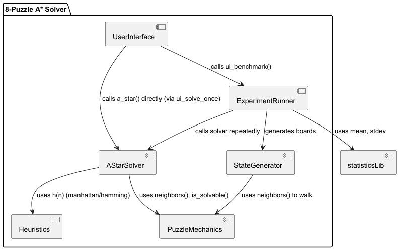

# 8 Puzzle Documentation

### Team

| Name 						                | Part                                         |
|----------------------------|----------------------------------------------|
| Arooj Shahzadi			          | UI                                           |
| Helena Mouro		             | Generator, types and constants and mechanics |
| Junu Rahman                	 | Heuristics and benchmark                     |
| Theresa Hartmann				       | A* search                                    |

### Short task description
The 8-puzzle is a 3×3 sliding-tile puzzle where eight numbered tiles and one empty space must be rearranged to achieve a goal configuration. It is a classic problem in Artificial Intelligence for evaluating search algorithms. A* search is used because it guarantees optimality and completeness when the heuristic is admissible.
The A* algorithm evaluates nodes using the function f(n) = g(n) + h(n), where g(n) is the path cost so far, and h(n) is the heuristic estimate of the remaining cost. The heuristics tested are:
 - Hamming distance: counts the number of misplaced tiles.
 - Manhattan distance: sums the grid distances of each tile from its correct position.
Both heuristics are admissible and consistent. However, Manhattan distance is generally more informative because it accounts for how far each tile is from its goal rather than just whether it is misplaced.

### Software architecture diagram

### Short descriptions of modules and interfaces
The Python implementation consists of separate functions for solvability checking, heuristic computation, and A* search. The system tests 100 random solvable puzzles and records nodes expanded and runtime for both heuristics.
The solver uses a priority queue to select nodes with the smallest f-value. Each state maintains parent pointers for path reconstruction. Only solvable puzzles (even inversion count) are tested to ensure valid comparisons between heuristics.

| Module 						               | Description                                                                                                                                                                                                                                                    | Functions                                                                                       | Inputs                                             | Outputs                                                                                            |
|-----------------------------|----------------------------------------------------------------------------------------------------------------------------------------------------------------------------------------------------------------------------------------------------------------|-------------------------------------------------------------------------------------------------|----------------------------------------------------|----------------------------------------------------------------------------------------------------|
| Types and Constants         | Define the base data structures and goal configuration used throughout the program. | goal_pos(v)                                                                                     | v: an integer tile value (0–8) representing a tile | (row, col): the goal position of that tile in the goal state grid.                                 |
| Heuristics                	 |                                                                                                                                                                                                                                                                | hamming(state) manhattan(state)                                                             |
| Mechanics		                 | Actions inside boards: checks all neighbors ( possible boards deriving from a state, from a blank tile movement) and if a board is solvable (if the number of inversions, when a tile is bigger then its following, is dividable by 2, the board is solvable). | neighbors(state) is_solvable(state)                                                         | A State tuple                                      | List of new states (List[State]) deriving from input and bool whether a puzzle is solvable or not. |
| A* Search				               | Expplores puzzle states using a priority queue (heap) based on cost so far and estimated cost to goal. Reconstructs the solution path once the goal is reached.                                                                                                                                                                                                                                                               | a_star(...) reconstruct_path(...)                                                           |
| Random generator					       | Creates new boards which are solvable.                                                                                                                                                                                                                         | generate_random_solvable_board(...)                                                             | steps: number of random moves to apply and startState: starting board (default = GOAL)        | A new solvable puzzle state (tuple of 9 integers)                                                                                                   |
| UI & helpers					           |                                                                                                                                                                                                                                                                | format_state(state) ask_int(...)  parse_state_from_input(...) choose_heuristic(...) |
| UI actions				              |                                                                                                                                                                                                                                                                | ui_solve_once() ui_benchmark()                                                              |
| Experiment/Benchmark				    |                                                                                                                                                                                                                                                                | run_experiment(...) summarize(...) print_table(...)                                     |

### Design decisions
-why truple choosen to save the puzzles - The puzzle states were represented as tuples of integers because tuples are immutable and hashable, allowing them to be used safely as keys in dictionaries and members of sets. This makes it easy to check whether a state has been visited and to store parent relationships efficiently. Tuples are also lightweight and compact, offering a simple and efficient way to represent the 3×3 board without extra class overhead
-A* search - tried to choose very clear variable names and comment on steps to explain and support logic/ process understanding
-In A* search a priority queue (min-heap) was used to manage the open list. This makes sure that the puzzle state with the lowest estimated cost is always selected first, because we wanted to make it as efficient as possible. The heap stores each state along with its f(n) score, which combines the actual cost from the start (g) and the estimated cost to the goal (h). This allows A* to explore the most promising path first. We also decided on using a heap in order to avoid manually searching trough all the remaining states, which would be slower and less scalable

-why one class- Finally, the solver was designed around one main class or functional module rather than multiple classes. This keeps the structure simple and emphasizes the algorithmic logic instead of object-oriented complexity. The functions are modular and self-contained, making the program easy to test, extend, and understand while focusing on how the search operates rather than on managing extra abstractions.

### Discussion and conclusion
In 100 random trials:
 - Hamming mean nodes expanded: 13044.7
 - Manhattan mean nodes expanded: 1494.5
 - Hamming standard deviation: 1805.27
 The Manhattan heuristic required about 90% fewer node expansions on average, demonstrating higher efficiency.
Manhattan distance significantly reduced both time and memory usage compared to Hamming. In difficult configurations, Hamming expanded tens of thousands of nodes, while Manhattan often required fewer than 3,000. This supports the claim that a more accurate heuristic reduces the effective branching factor.
Both heuristics ensured optimal solutions. However, Manhattan dominates Hamming because it provides tighter estimates of the remaining cost. A* with Manhattan therefore explores fewer states, resulting in lower time complexity.
The relationship between heuristic accuracy and performance is exponential: as h(n) approaches the true cost, the number of explored nodes drops sharply. This explains the large observed difference between the two heuristics.
The A* algorithm efficiently solves the 8-puzzle problem. The Manhattan heuristic outperforms the Hamming heuristic in terms of both runtime and node expansions. Therefore, it is a more suitable heuristic for grid-based search problems.

Both heuristics ensured optimal solutions. However, Manhattan dominates Hamming because it provides tighter estimates of the remaining cost. A* with Manhattan therefore explores fewer states, resulting in lower time complexity.
The relationship between heuristic accuracy and performance is exponential: as h(n) approaches the true cost, the number of explored nodes drops sharply. This explains the large observed difference between the two heuristics.

The A* algorithm efficiently solves the 8-puzzle problem. The Manhattan heuristic outperforms the Hamming heuristic in terms of both runtime and node expansions. Therefore, it is a more suitable heuristic for grid-based search problems.

### Conclusion
The A* algorithm efficiently solves the 8-puzzle problem. The Manhattan heuristic outperforms the Hamming heuristic in terms of both runtime and node expansions. Therefore, it is a more suitable heuristic for grid-based search problems.

